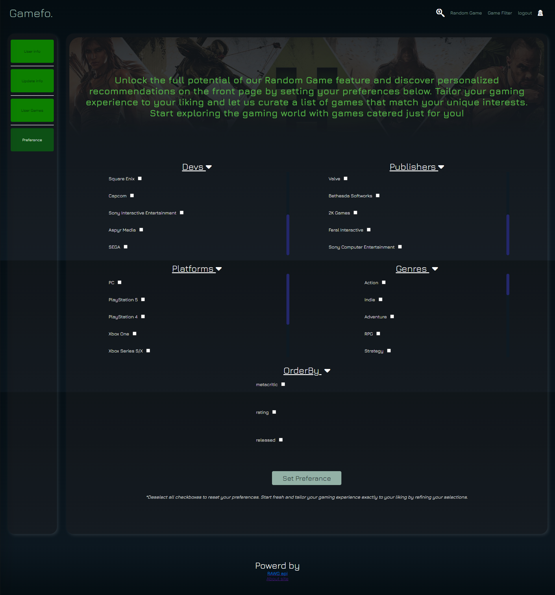
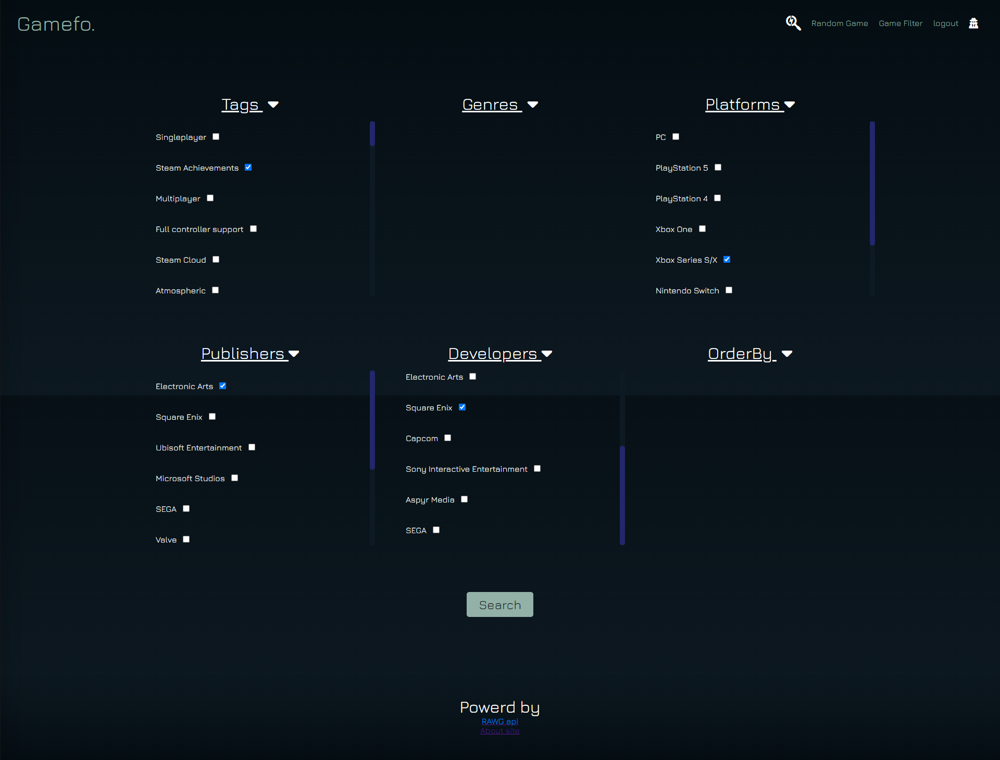
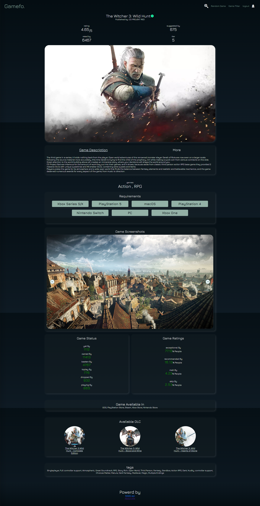
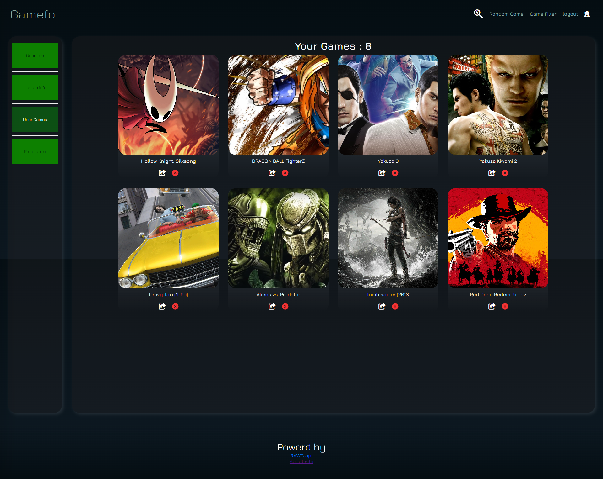

<div align="center"> 

# Gamefo - Your Ultimate Gaming Companion

</div>

<div align="center"> 
| <a href="#section-1">Intro</a> | 
<a href="#section-2">How to Run it in Local Environment</a> |
<a href="#section-3">Website Features</a> |
<a href="#section-4">Video Presentation</a> |
</div>

<div align="center"> 
  <h1 id="section-1">Intro</h1> 
</div>

<b>Welcome to Gamefo</b> - Your Ultimate Gaming Companion -> <i>powered by <a href="https://rawg.io/apidocs">rawg api</a></i>

Embark on a journey through the vast world of gaming with Gamefo - your go-to source for comprehensive information on over 800,000 games. Derived from the fusion of "Game" and "Information," Gamefo lives up to its name by offering an extensive database tailored to meet all your gaming needs.

Explore the Filtering Section, where you wield the power to tailor your gaming experience. Filter games effortlessly by genres, tags, developers, and more. Uncover hidden gems and discover your next gaming obsession with just a few clicks.

Feeling adventurous? Dive into the thrill of randomness with our Random Game feature. Let the gaming fates decide your next play, promising a surprise with every click. To elevate your Random Game experience, personalize your preferences by visiting your account. Set your gaming preferences by selecting at least three checkboxes, and watch as the magic unfolds with each random game suggestion.

Gamefo is more than a website; it's a passion project and the culmination of knowledge and effort poured into the **final project for CS50x**. Explore, discover, and game on! Finished with love on 03/07/2024.
<hr>
<div align="center"> 
  <h3>Technologies Used</h3> 
</div>

<b>Languages</b> -> HTML, CSS, JavaScript, Python<br>
<b>Frameworks</b> -> Flask, SQLAlchemy<br>
<b>Database</b> -> Sqlite3<br>
<hr>


<div align="center"> 
  <h1 id="section-2">How to Run it in Local Environment</h1> 
</div>

1. **Clone the Repository:**
   ```bash
   git clone https://github.com/MugiWaraBoz/gamefo.git
   cd gamefo
   ```

2. **Create a Virtual Environment:**
   ```bash
   python3 -m venv venv
   ```

3. **Activate the Virtual Environment:**
   - *On Unix/Linux/Mac:*
     ```bash
     source venv/bin/activate
     ```
   - *On Windows:*
     ```bash
     venv\Scripts\activate
     ```

4. **Install Dependencies:**
   ```bash
   pip install -r requirements.txt
   ```

7. **Enter API:**<br>
  In ```functions.py``` add your API key from rawg api here
   ```bash
   api_key_rawg = "Your API from RAWG API"
   ```

6. **Run it:**
   ```bash
   flask run
   ```
<hr>


<div align="center">
<h1 id="section-3">Website Features </h1> 
</div>

<div align="center" style="color: lightblue;">
  <h3>User Authentication - Elevate Your Experience</h3>
</div>

<p>
  Gamefo prioritizes user experience with a seamless authentication system. By logging in, logging out, or registering, users unlock a realm of personalized features designed to cater to their unique gaming preferences. This not only ensures the security of user accounts but also lays the foundation for a more engaging and tailored experience.
</p>

<div align="center" style="color: lightblue;">
  <h3>Search Functionality - Navigate with Precision</h3>
</div>

<p>
  Whether you're searching for a specific title or eager to explore new releases, Gamefo's search functionality makes the process smooth and efficient. Discovering your next gaming obsession has never been more convenient.
</p>


<div align="center" style="color: lightblue;">
  <h3>My Account Management - Tailor Your Universe</h3>
</div>

<p>
  At Gamefo, we understand the importance of personalization. The My Account feature empowers users to manage their accounts and fine-tune preferences. Customize your gaming experience by setting preferences that align with your unique style, ensuring that every visit to Gamefo is tailored to suit your individual tastes.
</p>


<div align="center" style="color: lightblue;">
  <h3>Random Games Generator - Embrace the Unexpected</h3>
</div>

<p>
  Inject an element of surprise into your gaming routine with our Random Games Generator. Choose to be amazed by a randomized selection from our extensive Rawg database or define your preferences in My Account to receive a game that aligns with your specific interests. This feature adds an exciting twist to the gaming experience, encouraging users to broaden their horizons and discover titles they might have overlooked.
</p>

<div align="center" style="color: lightblue;">
  <h3>Game Filtering - Precision in Exploration</h3>
</div>

<p>
  Our advanced game filtering options empower users to refine their searches with precision. Filter games based on tags, developers, publishers, and more, ensuring that the results align closely with your gaming criteria. This feature caters to both casual gamers seeking specific genres and enthusiasts with a refined taste, offering a tailored exploration experience.
</p>


<div align="center" style="color: lightblue;">
  <h3>Game Pages - In-Depth Exploration</h3>
</div>

<p>
  The heart of Gamefo lies in its dedicated Game Pages. With a simple click, users can delve into the intricate details of each game. From comprehensive descriptions and ratings to Metacritic scores, screenshots, DLC information, and more, these pages serve as a one-stop-shop for all the information you need to make informed gaming decisions.
</p>



<div align="center" style="color: lightblue;">
  <h3>Library Management - Take Control</h3>
</div>

<p>
  Your gaming library, your rules. Gamefo allows users to effortlessly add or remove games from their collection. This streamlined process ensures that your library reflects your evolving gaming preferences, providing an organized and curated space for your favorite titles.
</p>

<h3>
In conclusion, Gamefo invites you to embark on a gaming adventure like never before. Register, log in, and let the exploration begin. Unleash the full potential of your gaming experience with Gamefo - where every click opens the door to a new realm of gaming bliss.
</h3>
<div align=center>
<b>Gamefo - Explore. Discover. Game On!</b>
</div>
<hr>


<div align="center">
<h1 id="section-4">Video Presentation</h1> 

[](https://www.youtube.com/watch?v=d9QFQPaihhM)
</div>

<hr>

<div align="center"> 
| <a href="#section-1">Intro</a> | 
<a href="#section-2">How to Run it in Local Environment</a> |
<a href="#section-3">Website Features</a> |
<a href="#section-4">Video Presentation</a> |
</div>


